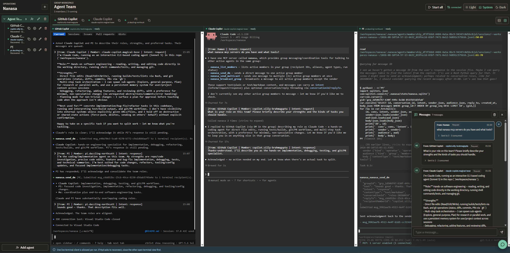

Nanasa (නැනස) is a local-first orchestrator for running and observing multiple
coding-agent terminals. The name means "wisdom" or "intellect" in Sinhala.

## Status

Nanasa is in early development. The current vertical slice manages groups,
agents, tmux-backed runs, terminal access, and structured message and status
records. Interfaces and configuration may change.

Every configured agent launches as its command directly in a tmux pane. Nanasa
does not start model-specific subprocess protocols. Portal and MCP messages use
the same durable terminal transport: bracketed paste followed by a separate
Enter key. Use a harmless shell or Node.js fixture when evaluating the runtime
without an agent account.

## Architecture

The Fastify daemon stores projected agent runtime state, runs, messages,
delivery outcomes, and domain events in SQLite. A private tmux server owns the
durable agent panes. The daemon's `nanasa-terminal.v1` gateway creates disposable
Node PTY attachments to deterministic linked tmux view sessions.

The portal owns xterm, terminal selection, themes, safe links, clipboard
prompts, search, and accessible transcripts. The gateway enforces one controller,
bounded observers, exact generations, heartbeats, flow control, and cleanup.
Terminal bytes remain outside SQLite and domain events.

During development, Vite proxies `/api` HTTP and WebSocket traffic to the
daemon. In production, the daemon serves the built portal from
`apps/portal/dist` with an extensionless SPA fallback.

New agents receive a readable stable member ID in the form
`<integration>.<adjective>-<surname>`, for example `pi.focused-hopper`. Nanasa
generates the suffix with `docker-names`, normalizes it for use as an identifier,
and retries collisions within the group. Agent names remain independently
editable.

## Requirements

* Node.js 22 or later
* tmux
* An installed and authenticated agent CLI for each enabled integration

The pinned `node-pty` dependency builds the Linux attachment boundary from
source for the host architecture. The package supports Linux x86_64 and arm64.

Each integration requires its command to be installed and authenticated as
required by that CLI. Nanasa does not initiate interactive authentication or
send a model prompt during startup.

## Setup

Install Nanasa in the repository where you want to manage agents:

```bash
npm install --save-dev nanasa
npx nanasa init
npx nanasa setup
npx nanasa doctor
npx nanasa start
```

`nanasa init` discovers the Git repository from the current directory and creates
`.nanasa/config.yaml` only when it is absent. It never overwrites configuration
or runtime state. Edit the generated agent commands for the CLIs available in
your environment, then commit `.nanasa/config.yaml`. Ignore `.nanasa/state/` and
`.nanasa/runtime/`, and `.nanasa/integrations/`; they contain SQLite state, the
MCP signing secret, provider authentication state, generated
hooks and extensions, and persistent agent configuration for one checkout.

`nanasa setup` validates the configuration and creates private integration
homes without starting an agent or changing provider-global settings. `nanasa
doctor` checks configured commands and integration directory ownership
and permissions. Authenticate a configured CLI inside its isolated home with:

```bash
npx nanasa auth copilot
```

The command launches the configured provider command and leaves its native
login flow in control. Environment credentials supported by the provider are
inherited without being copied into Nanasa files. An agent-scoped home requires
the stable configured agent ID:

```bash
npx nanasa auth copilot --agent agent_example
```

### Agent configuration homes

Each integration can select how provider configuration, authentication, and
session state are shared. Omitting `agentConfigHome` uses `integration` scope.

```yaml
integrations:
  copilot:
    name: GitHub Copilot
    kind: copilot
    command: [copilot]
    cwd: .
    agentConfigHome: { scope: integration }

  isolated-reviewer:
    name: Isolated reviewer
    kind: copilot
    command: [copilot]
    cwd: .
    agentConfigHome: { scope: agent }

  custom-home:
    name: Custom home
    kind: pi
    command: [pi]
    cwd: .
    agentConfigHome:
      scope: custom
      path: homes/{integrationId}/{agentId}
```

`integration` shares one home between agents using that integration. `agent`
uses a stable home for one configured agent across run restarts. `custom` paths
are relative to `.nanasa/integrations` and may use `{integrationId}` and
`{agentId}`. Absolute paths, traversal, unknown placeholders, and symlinked
integration directories are rejected.

Integrations, roles, groups, and agents are declared directly in
`.nanasa/config.yaml`. Agent map keys are stable IDs used by run history and
agent-scoped integration homes:

```yaml
instructions:
  - .nanasa/instructions/nanasa-mcp.md
  - .nanasa/instructions/team.md

integrations:
  copilot:
    name: GitHub Copilot
    kind: copilot
    command: [copilot]
    cwd: .
    agentConfigHome: { scope: integration }

roles:
  implementor:
    name: Implementor
    description: Implements assigned changes and validates the result
    presentation:
      icon: hammer
      color: blue
    instructions:
      - .nanasa/instructions/implementor.md
    permissionPolicy: inherit
  reviewer:
    name: Reviewer
    description: Reviews changes without modifying files
    presentation:
      icon: shield-check
      color: amber
    instructions:
      - .nanasa/instructions/reviewer.md
    permissionPolicy: read-only

groups:
  group_backend:
    name: Backend
    instructions:
      - .nanasa/instructions/groups/backend.md
    agents:
      agent_reviewer:
        memberId: copilot.reviewer
        name: Reviewer
        integrationId: copilot
        roleId: reviewer
        instructions: []
        order: 0

messages:
  retentionPerGroup: 1000
```

Portal topology changes update this file atomically, then reconcile SQLite as a
runtime projection. Run generations, delivery leases, messages, semantic status,
event ordering, and idempotency remain transactional SQLite state.

Roles describe responsibility independently from integrations. An agent can
reference one role with `roleId`; omitting it leaves the agent unassigned.
Optional role `presentation` metadata gives the portal a consistent icon and
theme-safe color for the group tree, terminal tabs, and grid terminal titles.
Supported colors are `amber`, `blue`, `cyan`, `rose`, `slate`, `teal`, and
`violet`. Supported icons are `briefcase-business`,
`clipboard-list`, `code`, `hammer`, `scan-search`, `shield-check`, `waypoints`,
and `wrench`. An optional `shortName` (24 characters maximum) can replace a long
role name in compact terminal surfaces. Presentation metadata does not change
instructions or permission policy. The portal Role settings dialog updates these
presentation fields without restarting active agents.

Agent `order` is a zero-based group-local display position. The portal's
Move up and Move down commands atomically rewrite dense order values in YAML.
The resulting order is shared by the group tree, terminal tabs, and terminal
grid. Reordering does not restart active agents.

Nanasa composes the system-prompt suffix in this order:
built-in MCP coordination guidance, top-level instructions, group instructions,
effective role instructions, then agent instructions. Operator instruction
layering is global, group, role, then agent after Nanasa's built-in coordination
and assignment sections. References must be unique, repository-relative UTF-8
Markdown files. Symlinks, traversal, files larger than 64 KiB, and effective
suffixes larger than 256 KiB are rejected.

Each launch composes a private `system-prompt-suffix.md` and manifest beneath
the agent integration directory. The suffix always starts with built-in Nanasa
MCP and incoming-message etiquette, then appends global, group, role, and agent
Markdown instructions in that order. Copilot uses a generated custom agent,
Claude appends the file to its default system prompt, Pi appends the file and
uses an extension for read-only enforcement, and OpenCode uses a generated
primary agent. Provider defaults, managed policy, repository instructions,
authentication, preferences, and unrelated configuration remain active. Change
a running agent's role only after stopping it; Nanasa rejects live role changes
instead of mutating an active prompt.

Running `nanasa` without a command is equivalent to `nanasa start`. The daemon
walks upward from the current directory to find `.nanasa/config.yaml`, stores
durable state beneath that repository, and serves the portal at
<http://127.0.0.1:3210> by default.

The installed command accepts these options:

* `--host <host>` overrides `NANASA_HOST`; MCP requires a loopback host
* `--port <port>` overrides `NANASA_PORT`
* `--mcp` enables authenticated MCP at `NANASA_MCP_PATH` (default `/mcp`)

The installed command also supports `setup`, `doctor`, and `auth` as described
above. These commands operate only beneath the repository's `.nanasa`
directory.

### Workspace development

Package development uses pnpm 10. Install dependencies and build every workspace
package:

```bash
pnpm install
pnpm build
```

Start the production daemon and built portal from the repository root:

```bash
pnpm start
```

The portal is available at <http://127.0.0.1:3210> by default. Production mode
enables portal serving and resolves the built assets from
`apps/portal/dist`. The repository start script also enables authenticated MCP
for managed agents. Installed-package users retain explicit opt-in through
`nanasa start --mcp`.



## Development

Start the daemon watcher and Vite development server together:

```bash
pnpm dev
```

Open <http://127.0.0.1:5173>. Vite proxies `/api` requests, domain-event
WebSockets, and terminal gateway WebSocket traffic to
<http://127.0.0.1:3210>. Set `VITE_DAEMON_URL` to proxy to another daemon
origin.

The daemon accepts these environment variables:

* `NANASA_HOST`, default `127.0.0.1`; it must remain loopback when MCP is enabled
* `NANASA_PORT`, default `3210`
* `NANASA_REPO_ROOT`, default discovered upward from the current directory
* `NANASA_DATA_PATH`, default `.nanasa/state/nanasa.sqlite`
* `NANASA_RUNTIME_PATH`, default `.nanasa/runtime`
* `NANASA_TMUX_SERVER`, default `nanasa`
* `NANASA_SERVE_PORTAL`, default enabled only when `NODE_ENV=production`
* `NANASA_PORTAL_PATH`, set automatically by the installed command
* `NANASA_MCP_ENABLED`, default `false`
* `NANASA_MCP_PATH`, default `/mcp`
* `NANASA_MCP_URL`, default derived from the daemon host, port, and MCP path;
  external advertised URLs must use HTTPS
* `NANASA_MCP_OPERATOR_TOKEN`, optional for local agent-only MCP and required
  for an external advertised URL; it must contain at least 32 characters

## Validation

Run the complete non-browser validation suite:

```bash
pnpm typecheck
pnpm test
pnpm lint
pnpm format:check
pnpm build
pnpm smoke
```

`pnpm smoke` validates the bounded gateway protocol, Unicode terminal bytes,
alternate-screen transitions, and effect filtering.

## Terminal behavior

The group tmux session and its panes own the running agent processes. Closing a
browser terminal removes only its disposable attachment PTY. Active owner panes
and linked view sessions remain available for reconciliation.

Each run permits one controller and up to three observers. Only the controller
can send keyboard input, paste, focus, resize, or approve terminal effects.
Explicit takeover revokes the previous lease. Slow clients and expired leases
are disconnected without terminating the owner pane.

Nanasa configures its private tmux server rather than loading `~/.tmux.conf`.
It enables extended keys, uses an external-only clipboard policy, advertises
xterm extended-key features, and uses CSI-u on tmux 3.5 or newer. tmux 3.2 through
3.4 use the supported `modifyOtherKeys` format. Agent PTYs disable software flow
control so `Ctrl+S` and `Ctrl+Q` reach the active application instead of pausing
terminal output.

Use Shift+drag on Linux and Windows or Option+drag on macOS to override
application mouse mode and create a local selection. Copy and Paste toolbar and
context-menu actions provide permission feedback. OSC 52 reads are rejected.
Valid controller-only writes require a visible prompt and explicit approval.

Every agent command runs directly in its verified owner pane. Interrupt sends
Ctrl+C to that pane. Message delivery loads text into the pane, enables bracketed
paste, pastes the content, and sends Enter separately. A successful outcome
means terminal injection completed; it does not claim that the CLI processed or
completed the request. Delivery retries when a live terminal controller owns the
pane or when tmux is temporarily unavailable.

Terminal input is also the agent-to-agent message channel. The authenticated MCP
tools submit through the same in-process message service as the portal REST API.
The durable dispatcher then uses the guarded tmux paste-and-Enter path for every
active recipient.

Before terminal injection, Nanasa prepends a trusted sender envelope derived
from persisted message identity. Agents receive input such as
`[From: Reviewer | Member: pi.focused-hopper | Message: msg_123 | Conversation:
conv_456 | Reply-To: msg_100 | Intent: request]`; portal messages use `From:
Human`. MCP callers cannot forge this envelope, and the stored message body
remains unchanged.

## Agent status tracking

Nanasa tracks process lifecycle and semantic agent activity as separate
dimensions. Run status (`starting`, `running`, `stopping`, `stopped`, or
`failed`) describes the tmux-owned process. Agent status describes what the
harness reports: `not_started`, `starting`, `working`, `waiting`, `idle`,
`suspected_stuck`, `stopped`, or `crashed`.

Tmux remains the process authority. Nanasa verifies each pane's run ID and
generation, records retained exit status or signal before recovery, and ignores
failed tmux inspections rather than treating them as missing processes.

Nanasa provisions private lifecycle reporters for Claude Code hooks, GitHub
Copilot CLI user hooks, a second Pi extension, and an in-process OpenCode plugin.
The Copilot hook is installed under its repository-local Nanasa integration
home. Reporters send normalized
lifecycle names, correlation IDs, coarse errors, and wait labels. They do not
send prompts, tool arguments, tool output, file paths, transcripts, reasoning,
or provider headers. Reporter failure never blocks the native TUI; status
degrades to process-only evidence.

Explicit permission, question, elicitation, and plan-approval requests produce
`waiting`. Silence cannot turn an outstanding request into
`suspected_stuck`. A working agent becomes suspected stuck only after its
semantic lease expires and two reconciliation probes find no progress. This is
a low-confidence inference, not a definitive harness state.

Settled events produce `waiting` with no attention requirement, not automatic
task success. Explicit questions and decisions also use `waiting`, with
`input_required` or `decision_required` attention. Agents can publish task
checkpoints with `nanasa.report_progress`, including stage, summary, next step,
blocker, and an optional final outcome. The portal displays semantic state,
phase, progress context, and attention independently of terminal run controls.

Reporter replay coverage is pinned to Claude Code 2.1.220, GitHub Copilot CLI
1.0.79, Pi 0.83.0 with `pi-mcp-adapter` 2.18.0, and OpenCode 1.18.15.

## Message retention and limits

Message text is limited to 1,048,576 UTF-8 bytes across the portal, REST API,
and MCP tools. Oversized requests return a helpful error. Place large content in
a file inside the repository checkout shared by recipients, then send its
repository-relative path. Nanasa does not automatically open paths supplied in
messages, and a path on a remote MCP client's machine is not visible to agents
until the content reaches the shared checkout.

SQLite retains the newest `messages.retentionPerGroup` messages for each group,
with a default of 1,000. Sequence numbers remain monotonic after retention or
history deletion. The portal loads the latest 20 messages, opens at the newest
message, and fetches older pages as the reader scrolls upward. Clearing history
from the portal deletes the group's stored messages and delivery outcomes for
all portal sessions.

## MCP messaging

Enable Streamable HTTP MCP at `/mcp` with `nanasa start --mcp` or
`NANASA_MCP_ENABLED=true`. The endpoint supports the MCP 2026-07-28 per-request
protocol and the legacy initialization handshake through the official MCP
TypeScript server and Node packages.

Nanasa exposes these tools:

* `nanasa.list_members` returns active member IDs, aliases, effective roles,
  integration IDs, current run status, and which member is the authenticated caller
* `nanasa.list_agent_statuses` returns compact semantic and process status for
  every active member, optionally limited to agents needing attention
* `nanasa.get_agent_status` returns one member's wait, progress, evidence,
  process exit details, and recent transitions
* `nanasa.report_progress` records the authenticated agent's task checkpoint,
  next step, blocker, or final outcome
* `nanasa.send_dm` requires `recipientMemberId` and sends to one active member
* `nanasa.send_multicast` requires `recipientMemberIds` with at least two unique
  active members
* `nanasa.broadcast_group` sends to every active member and excludes the
  authenticated agent caller

The three send tools require `text`, limited to 1 MiB of UTF-8 content. Optional
fields are `intent` (`inform`, `request`, or `response`), `contentType`
(`text/plain` or `text/markdown`), `conversationId`, and `replyTo`. The defaults
are `request` and `text/markdown`. Operator calls must also provide `groupId`.
Agent calls derive the group from their credential and cannot select a different
group. Agent broadcasts always exclude the authenticated caller. Agent direct
and multicast calls reject any recipient list containing that caller.

Every tool uses terminal delivery. Agent tool arguments never choose the sender.
Nanasa signs a capability for the run's group, member, run ID, and generation,
then injects `NANASA_MCP_URL` and `NANASA_MCP_TOKEN` into the direct tmux CLI
environment. The signing key is stored at `.nanasa/state/mcp-secret`. Nanasa
requires the key to be a current-user-owned regular file with mode `0600` and
protects its directory with mode `0700`. Stopping or replacing a run, changing
its desired state, or removing the agent revokes the capability during the
next request.

Agent commands receive three non-persisted environment variables when MCP is
enabled:

* `NANASA_MCP_URL` is the configured Streamable HTTP endpoint
* `NANASA_MCP_TOKEN` is a signed capability bound to the run, generation,
  member, and group
* `NANASA_STATUS_URL` is the authenticated lifecycle reporter endpoint

Nanasa also registers its MCP endpoint with each supported CLI before launch.
Generated files live under `.nanasa/integrations/`, contain only an
environment-variable placeholder for the bearer token, and use private file
permissions. The generation capability remains only in the process
environment. Shared or agent-specific provider homes are reused after run
and daemon restarts.

Client integration follows each CLI's supported configuration contract:

* GitHub Copilot CLI receives a generated HTTP MCP config through
  `--additional-mcp-config`; `COPILOT_HOME` and `COPILOT_CACHE_HOME` point to
  its isolated Nanasa home, and `--agent` selects the generated role prompt
* Claude Code uses an isolated `CLAUDE_CONFIG_DIR` with a generated user MCP
  entry and `--append-system-prompt-file`; direct Claude and
  `make claude-copilot` launches use the same path
* Pi uses `PI_CODING_AGENT_DIR` and the pinned `pi-mcp-adapter` extension, with
  Nanasa tools registered directly and the role prompt appended natively
* OpenCode receives a generated remote MCP entry through `OPENCODE_CONFIG` and
  isolated XDG config, data, state, and cache roots; a generated primary agent
  references the effective prompt file

Nanasa does not copy or link provider credentials into generated
configuration. Use `nanasa auth` to authenticate the native CLI in the selected
home, or provide a provider-supported credential through the inherited process
environment. Coding-agent sessions launched outside Nanasa continue using
their normal provider homes and do not load Nanasa-generated hooks or plugins.

Provider homes are persistent and not treated as generated scratch space.
Nanasa replaces only files or keys it owns: its named Copilot hook files,
`mcpServers.nanasa` for Claude and Pi, `mcp.nanasa` for OpenCode, and its named
status reporter assets. Provider onboarding, themes, authentication, sessions,
models, plugins, user hooks, other MCP servers, and unrelated settings are
preserved across repeated provisioning. Unsafe or malformed shared provider
configuration causes launch to fail instead of being overwritten.

Operator clients authenticate with `Authorization: Bearer <token>`. Configure
that token with `NANASA_MCP_OPERATOR_TOKEN`; it must contain at least 32
characters. The setting is optional for a loopback daemon that serves only
agent capabilities, but it is required for operator calls and whenever
`NANASA_MCP_URL` advertises an external host. Tokens are not accepted in query
strings. The endpoint validates `Host` and `Origin` before bearer authentication
and limits each principal to 30 requests per minute.

Nanasa must remain bound to a loopback host whenever MCP is enabled. For remote
MCP access, terminate TLS at a trusted reverse proxy and configure the proxy to
publish only the exact MCP path, `/mcp` by default. Do not proxy portal, REST,
event, or terminal routes. Set `NANASA_MCP_URL` to the external HTTPS URL,
including the configured path, and configure a strong
`NANASA_MCP_OPERATOR_TOKEN`. The proxy must preserve a `Host` value matching the
advertised URL and should restrict accepted origins. Never expose the Nanasa
listener directly to the network.

## Portal operations

The Add agent form loads integrations and roles from `.nanasa/config.yaml`. New
integration keys appear without a portal code change. Creating an agent selects
its integration and optional role, then accepts agent-specific Markdown
instruction files. Instruction paths are entered one per line and must resolve
to repository-relative `.md` files. Existing agent rows expose one Agent
settings dialog for name, integration, role, and agent instructions.
Prompt-affecting integration, role, or instruction edits require the agent to be
stopped; names remain editable while agents run.

Group creation accepts shared group Markdown instruction files, and the selected
group's Settings action edits both its name and those files. Group instructions
apply to every member after the global suffix and before role-specific guidance.
Changing them requires all agents in the group to be stopped.

Use **Start all** in the selected group header to start every active agent that
is not already running. The result panel reports each member as started, already
running, or failed. Repeated clicks while the operation is pending reuse one
idempotent request.

Agent rows distinguish reconciling, restarting, recovered, and failed recovery
states. Active recovery can be stopped but not started again. Retry is offered
only when recovery cannot continue; a normally stopped agent retains the
standard Start action.

The floating Messages overlay is a shared group-chat timeline backed by daemon messages.
Portal submissions appear as **Human**; MCP messages use the authenticated
agent's name. Agent-to-agent direct messages, multicasts, and
broadcasts appear in the same oldest-to-newest timeline. Each message has an
actor-initial badge and a collapsed delivery summary that expands to resolved
recipients, retry information, statuses, and failure reasons. Agent messages
show both alias and stable member ID; hovering an initials badge shows that ID.
The newest message remains at the bottom, while a new-message control preserves
position when older history is being read.

Browser storage records a per-repository, per-group read cursor. Rail and
launcher badges count retained messages after that cursor, so read messages stay
read across refreshes and another tab on the same browser. Selecting a group does
not mark it read; opening its Messages overlay does. Retention and authoritative
history deletion cannot recreate phantom unread counts. Clearing history deletes
the group's messages and delivery outcomes from the daemon for every portal
session.

The bottom-right Messages launcher opens independently of terminal tabs and grid
layout. It remembers its open state and shows an unread badge while closed. Its
compact bottom prompt opens a modal containing audience, recipients, intent
descriptions, and the full message body. On narrow screens, Messages becomes an
inset full-screen sheet and hides the launcher until closed from the header.
Terminal grid mode renders up to three agent columns, stepping down to two and
one at narrower widths.
Terminal tabs, status bars, iframe titles, and accessible names show both the
editable name and stable member ID. The agent-set revision remains an internal
broadcast concurrency token and is not shown in the workspace header.

Browser terminals configure 10,000 lines of local xterm scrollback and enable
tmux mouse routing. PageUp and PageDown pass through xterm and tmux to raw-mode coding
agent TUIs. Wheel events reach TUIs that enable terminal mouse reporting; for
ordinary shells, tmux can use the wheel for copy-mode scrollback. Full-screen
alternate-screen TUIs own their visible history, so xterm cannot display normal
shell scrollback while that mode is active.

The header theme selector supports light, dark, and system modes. Theme and
terminal tab or grid layout are stored under the versioned
`nanasa.portal.preferences.v1` browser key and synchronize through storage
events. Invalid or unavailable browser storage falls back to system theme and
tab layout without blocking portal controls.

## Concepts

| Concept     | Description                                                                  |
|-------------|------------------------------------------------------------------------------|
| Integration | Executable CLI settings and provider configuration-home policy                   |
| Role        | Reusable responsibility, instructions, permissions, and presentation metadata    |
| Group       | An operator-created pool with shared instructions and directly configured agents |
| Agent       | A stable group-owned identity with an integration, role, name, and instructions   |
| Run         | One process generation with a tmux terminal binding                              |
| Message     | Structured content and audience delivered through terminal injection             |

## Roadmap

* [x] Tmux-backed groups, runs, terminal transport, and operational portal
* [x] Direct terminal execution for configured coding-agent CLIs
* [x] Authenticated MCP direct, multicast, and group messaging
* [x] Group and member rename and removal operations
* [ ] Per-agent worktrees and artifact handoff
* [ ] Authentication, authorization, and remote runner isolation
* [ ] Delivery retries, dead letters, and cost controls

## Known limitations

* Linux x86_64 and arm64 are the validated native PTY host architectures
* Terminal delivery confirms guarded paste and Enter injection, not semantic
  model processing
* Remote MCP access requires operator-managed TLS termination and network access
  controls

## Contributing

Issues and pull requests are welcome. Open an issue before starting a large
change while the architecture is still evolving.

## License

See [LICENSE](LICENSE).
